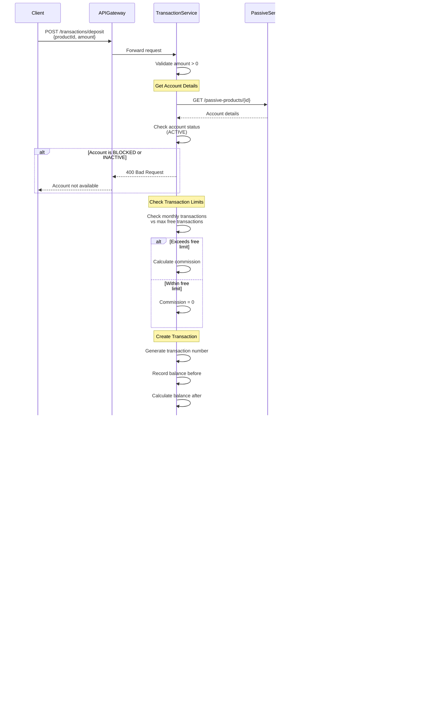

# Diagramas de Secuencia - Sistema de Microservicios Bancarios

## 1. Auth Service - Login y Autenticación

## 2. Customer Service - Crear Cliente

## 3. Passive Product Service - Crear Cuenta Bancaria

## 4. Active Product Service - Crear Crédito

## 5. Transaction Service - Realizar Depósito

## 6. Transaction Service - Realizar Retiro

```mermaid
sequenceDiagram
    participant Client
    participant APIGateway
    participant TransactionService
    participant PassiveService
    participant MongoDB
    participant Kafka
    
    Client->>APIGateway: POST /transactions/withdrawal<br/>{productId, amount}
    APIGateway->>TransactionService: Forward request
    
    TransactionService->>PassiveService: GET /passive-products/{id}
    PassiveService-->>TransactionService: Account details
    
    TransactionService->>TransactionService: Validate sufficient balance
    
    alt Insufficient balance
        TransactionService-->>APIGateway: 400 Bad Request
        APIGateway-->>Client: Insufficient funds
    end
    
    alt Account type is FIXED_TERM
        TransactionService->>TransactionService: Check movement day
        
        alt Not movement day
            TransactionService-->>APIGateway: 400 Bad Request
            APIGateway-->>Client: Fixed term only allows<br/>withdrawals on specific day
        end
    end
    
    TransactionService->>TransactionService: Calculate commission
    TransactionService->>TransactionService: Total amount = amount + commission
    
    TransactionService->>MongoDB: save(transaction)<br/>status: PENDING
    
    TransactionService->>PassiveService: PUT /passive-products/{id}/balance<br/>{newBalance}
    PassiveService-->>TransactionService: Balance updated
    
    TransactionService->>MongoDB: update status: COMPLETED
    TransactionService->>Kafka: Publish TransactionCompletedEvent
    
    TransactionService-->>APIGateway: 200 OK
    APIGateway-->>Client: Withdrawal successful
```

## 7. Debit Card Service - Crear Tarjeta de Débito

## 8. Debit Card Service - Realizar Pago con Tarjeta

## 9. Debit Card Service - Consultar Últimos Movimientos

## 10. Transfer Service - Transferencia Entre Cuentas Propias

## 11. Report Service - Generar Reporte Consolidado de Cliente

## 12. Report Service - Reporte de Promedio Diario de Saldo

## 13. Yanki Service - Enviar Pago

## 14. Yanki Service - Cargar Saldo desde Cuenta Bancaria

## 15. BootCoin Service - Solicitar Compra de BootCoin

## 16. BootCoin Service - Aceptar y Completar Intercambio

## 17. Event-Driven Communication - CustomerDeletedEvent

## 18. Circuit Breaker Pattern - Resilience

---

## Leyenda de Símbolos

- `->`: Llamada síncrona
- `-->`: Respuesta
- `->>`: Llamada asíncrona
- `-->>`: Respuesta asíncrona
- `--x`: Error/Fallo
- `-.->`: Llamada opcional/condicional
- `Note`: Comentario explicativo
- `alt/else`: Condición alternativa
- `loop`: Bucle
- `activate/deactivate`: Activación de participante